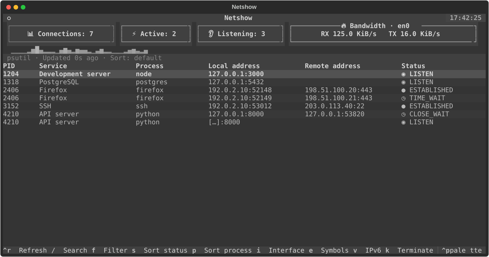
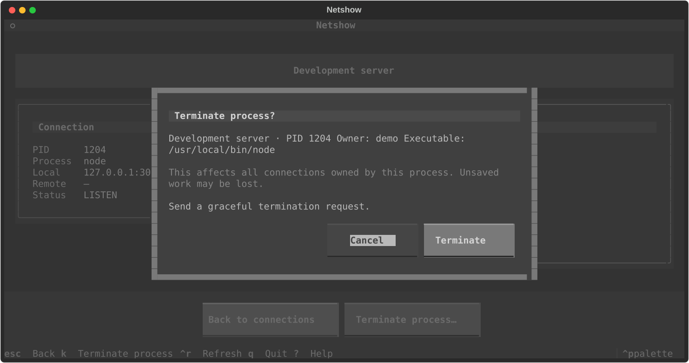

<div align="center">


**Interactive, process-aware network monitoring for your terminal.**

Python 3.11+ · macOS & Linux · Built with Textual
</div>



> This checkout contains the UI refresh in development. Screenshots use example data.
> `uvx netshow` runs the published release; use the source instructions below to try this version.

## Install and run

```sh
uvx netshow
```

For this development version:

```sh
git clone https://github.com/taylorwilsdon/netshow.git
cd netshow
uv sync --locked
uv run netshow
```

Or install the published package with `pipx install netshow`.

## What it shows

- Live TCP connections with PID, friendly service name, process, endpoints, and status.
- Process details including executable, owner, command, working directory, threads, and live CPU/memory usage.
- Host or interface bandwidth: separate receive/transmit rates and a 30-second sparkline.
- Regex search across PID, names, addresses, and status; invalid patterns fall back to literal matching.
- Process/status sorting that preserves your selection, plus full IPv6 details.
- Confirmed process termination with a separate force-kill option if the process stays alive.
- The original Selenized Dark palette and labeled metric chips, built-in light/dark/ANSI themes, and a compact layout for small terminals.

Netshow tries psutil first and falls back to `lsof` when access is denied, as is common
on macOS. Install `lsof` if your system doesn't include it. Without sufficient privileges,
results may be incomplete; the status line marks limited visibility. Collection failures
show an error and retain the last successful snapshot, marked stale.

Bandwidth is measured for the entire host or chosen interface. It is **not per-process
or per-connection throughput**. Summing interfaces may count traffic at multiple layers
on hosts with bridges, tunnels, or virtual interfaces.

## Usage

```sh
netshow --interval 1.5
netshow --no-colors
netshow --version
```

| Option | Behavior | Default |
| --- | --- | --- |
| `--interval SECONDS` | Positive, finite connection refresh interval | `3.0` |
| `--no-colors` | Monochrome rendering; also enabled by a nonempty `NO_COLOR` | Off |
| `--version` | Print installed version and exit | — |

Bandwidth samples every 0.5 seconds while the connection screen is visible.
Connection collection pauses during details/dialogs and resumes immediately on return.
Process details refresh every second while visible.

| Key | Action |
| --- | --- |
| ↑ / ↓ | Select a connection |
| Enter | Open selected connection details |
| Click | Highlight a row; click the highlighted row again to open details |
| Esc / ← | Return from details |
| Ctrl+R | Refresh the current connection/detail view |
| `/` / `f` | Open search / toggle search field |
| Enter in search | Return focus to the table |
| Esc in search | Hide the field; the active filter remains visible in the status line |
| `s` / `p` | Toggle status / process sorting; press again for default PID order |
| `i` | Cycle bandwidth interfaces |
| `e` | Toggle status symbols |
| `v` | Toggle full IPv6 addresses in the table |
| `k` | Confirm termination of the selected process |
| `?` | Toggle contextual keyboard help |
| Ctrl+P | Command palette, including theme selection |
| `q` / Ctrl+C | Quit |

Clear the search text to remove the filter. Settings last for the current session.
Single-letter shortcuts leave typing in the search field uninterrupted.

## Terminate a process

Select a connection and press `k`, or use **Terminate process…** in its detail view.
The dialog identifies the process and defaults to **Cancel**. Confirming **Terminate**
sends SIGTERM and waits up to three seconds. If it remains alive, a second confirmation
offers **Force kill**, which sends SIGKILL. Netshow never escalates automatically.



The action affects the whole process and all its connections, so unsaved work may be
lost. Netshow rechecks PID and creation time before each signal, blocks unknown identities,
PID 0/1, and itself, and reports permission failures or exited/replaced processes.
It does not terminate process trees or request elevated privileges.

## Development

```sh
uv sync --locked
uv run ruff format --check .
uv run ruff check .
uv run mypy src
uv run pytest -q
uv build
```

Run `uv run ruff format .` to format changes. CI tests Python 3.11–3.14 on Linux and
Python 3.14 on macOS, and verifies installations from both wheel and source artifacts.
Tests use synthetic connection data; process-control integration tests act only on
children they start themselves.

See [architecture](docs/architecture.md) and [release instructions](docs/releasing.md).
The earlier published version remains available for Python 3.9/3.10 users.

## License

[MIT](LICENSE). Issues and contributions are welcome on
[GitHub](https://github.com/taylorwilsdon/netshow/issues).
